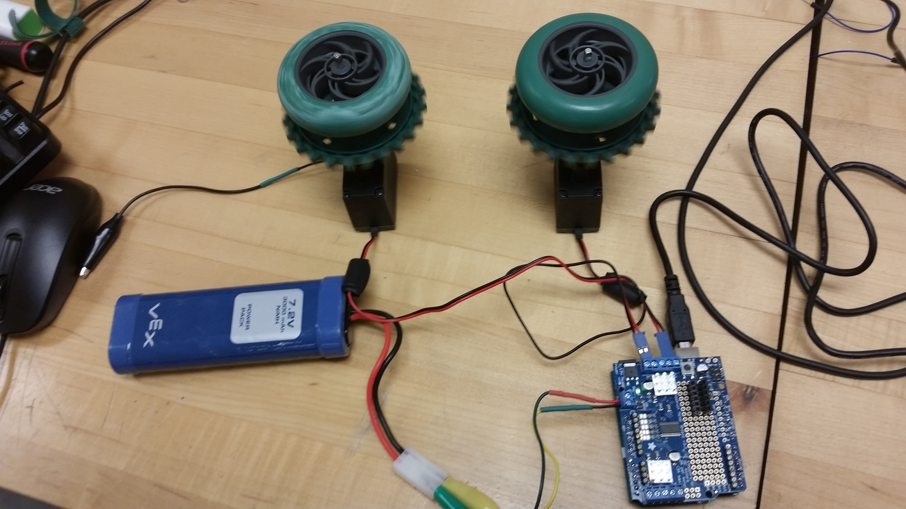

# Tank Movement Simulator

Simulate thread locomotion using VEX Motors, an Arduino Uno, and a motor shield.

## Introduction

So I wanted to play around with motors. I've used simple 5 V DC motors before, but controlling them with Arduino? This was the first time. I decided to use an Adafruit motor shield and VEX Robotics motors.

Essentially, the idea was to replicate the movement pattern of a tank, the key difference between that and the movement of a normal car being that the tank can turn in place (ie. turning radius of zero).

## Design

#### Behaviors

In order to implement thread movement, you really only need two motors. The turning behavior can be implemented as follows: To turn left, the left motor would run backward at the same rate that the right motor runs forward. To turn right, the opposite motors would run forward or backward respectively.

#### Functionality

The behavior of the tank can be controlled through the arrow keys of the keyboard on a computer.

* UP --> Forward movement
* RIGHT --> Turning RIGHT
* LEFT --> Turning LEFT
* DOWN --> Stop

## Implementation

* Uses Processing 3 to capture keyboard inputs

* Uses Serial connection for sending data back and forth from Arduino to computer

* Uses the Adafruit Motor Shield v2.3 to connect to the motors

## Run Locally

#### Requirements

##### Electronic Components

* 6-12V DC Power Supply, VEX Power Pack/Battery should work fine.
* 2-wire DC motors. I used the VEX 100 RPM 2-wire motor available from Amazon.
* Adafruit Motorshield v2.3. Will need to do some soldering work to assemble the shield if not already assembled.
* Arduino Uno
* Serial cable. Most convenient and easy to get is USB serial cable
* (Optional) 2 Square Bars and 2 VEX gears/wheels, good for visualizing the movement

##### Software

* Arduino IDE
* Processing 3

#### Instructions

##### Electric Connections

1. Put the Adafruit Motorshield on top of the Arduino board by aligning the pins with the headers in the Arduino.
2. Connect the DC motors to the M1 and M2 connections respectively.
3. Connect the Serial cable to the Arduino an a USB port on your computer.

##### Uploading to the Arduino board

4. Open up the Arduino IDE
5. Open the sketch. The sketch folder is [arduino/](arduino/).
6. Make sure a serial port is selected. Go to Tools -> Serial Port. Select the appropriate serial connection.
7. In the IDE, click on the Upload button.

##### Running the simulation

*The arduino IDE can now be closed.*

8. Open up Processing.
9. Open the sketch. The sketch folder is [processing/](processing/).
10. Run the sketch with the Play button in the IDE.

*Once the Processing script is running*

11. Connect the power supply to the 5-12V Power port of the Motorshield.

*And now you can control the motors with your ARROW keys.*

## License
See [LICENSE](LICENSE)
